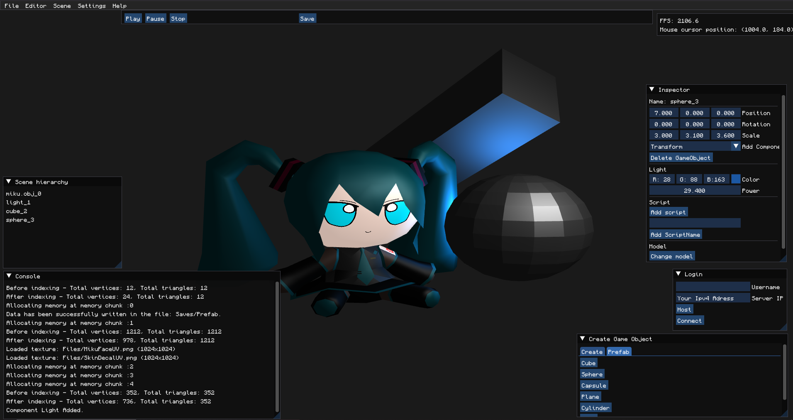

@mainpage  
[Release Link](https://github.com/Dranemo/Releases/releases/tag/VxVEngine)

# Welcome on VxV
*An OpenGL engine made by VxV Industries*   
[Henri T.](https://github.com/46Yuu) | [Hugo R.](https://github.com/Hroycode) | [Victor L.](https://github.com/Draknut) | [Yanaël C.](https://github.com/Dranemo) | [Melvin G.](https://github.com/Mguellaff) | [Gwendal A.](https://github.com/LiLPray) | [Adrien P.](https://github.com/Kybrien)
***
#### ❓ What is VxV ?
VxV is a homemade OpenGL engine we worked on for 5 weeks.   
It only has an educational purpose (for now at least) and it's the best way for us to understand properly HOW does a game engine work.   
***
#### 💬 How to use ?
1) You first need to rename the initServ function in `_Server.cpp` to main.
2) Go to `Main.cpp` and comment out the whole main.
3) Compile the solution and go to the `x64/Release folder.`
4) Rename the `VxV.exe` to `Server.exe`.
5) Go back to `Main.cpp` and `"CTRL+Z"` all your changes.
6) Same for `_Server.cpp`.
7) Compile the solution.
8) Launch `VxV.exe`.

***
#### ⚠️ Note
This project is not completed so the releases are not perfect and you may encounter issues or bugs while using it :)   
👇🏼 If you are interested in the extern libraries we used, it's just down below   
***
### External Libraries :   
*Overall documentation with [Doxygen](https://www.doxygen.nl)*   

We first used [GLFW](https://www.glfw.org/) :
> It provided us a simple API for creating windows, contexts and surfaces, receiving input and events.   

We then imported [GLEW](https://glew.sourceforge.net/) and [GLM](https://github.com/g-truc/glm) :
> GLEW helped us loading and managing OpenGL the "easy" way. It's in some way a portal between us and OpenGL, and it makes OpenGL convenient to use.   
> GLM is a header only C++ mathematics library for graphic software based on the OpenGL Shading Language (GLSL) specifications. It provides classes and functions designed and implemented with the same naming conventions and functionality than GLSL.

Considering the problems we got while trying to import images and textures ourselves with a "homemade" program... we imported [stbImage](https://github.com/nothings/stb) :
> Stb helps us with all the image loading and decoding from file and memory (it supports JPG, PNG, TGA, BMP, PSD, GIF, HDR, PIC files).

For the 3D objects importation we chose [tinyObj](https://github.com/tinyobjloader/tinyobjloader) since it's easy as pie to use :
> tinyObj is a single file wavefront obj loader that can parse over 10M polygons with moderate memory and time. It is perfect for embedding .obj loader to our (global illumination) renderer.

We then needed a Json reader/writer for managing our saves. Thanks to [jsonCPP](https://github.com/open-source-parsers/jsoncpp) we got all of that quite easily :
> JsonCpp is a C++ library that allows manipulating JSON values, including serialization and deserialization to and from strings.
> It can also preserve existing comment in unserialization/serialization steps, making it a convenient format to store user input files.   

For the UI of our engine, we finally decided to use [imGUI](https://github.com/ocornut/imgui)   

### SAMPLE :    

